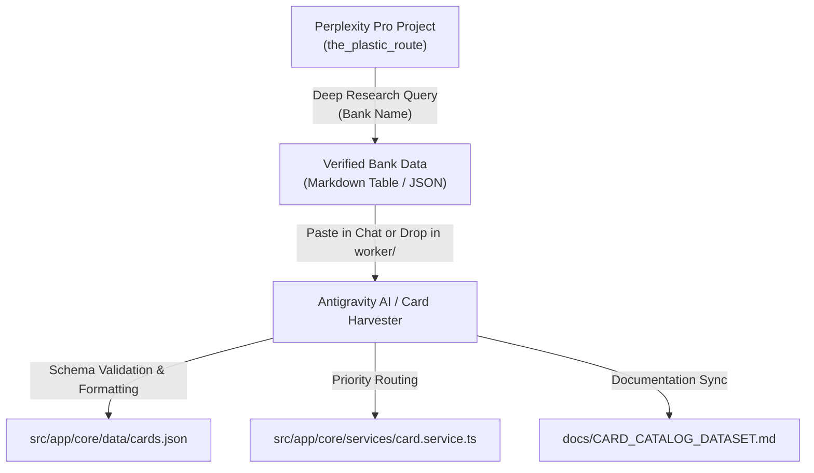

# 🧠 Perplexity Deep Research Integration & Data Harvesting Guide

This document defines the standardized research protocol, Perplexity Project configuration, prompt templates, and data ingestion pipeline for expanding **The Plastic Route** credit card master catalog.

---

## 🎯 Architecture & Data Harvesting Overview

The Plastic Route maintains a master catalog of Indian credit cards ([`src/app/core/data/cards.json`](../src/app/core/data/cards.json)) used for spend optimization and billing cycle analysis.

Because credit card terms, lounge spend criteria, reward sub-caps, and forex fees change frequently, we leverage **Perplexity Pro Deep Research** as an authoritative research engine to harvest complete, verified bank portfolios.



---

## ⚙️ Perplexity Project Setup (One-Time Configuration)

In your **Perplexity Pro Workspace**, create a dedicated Project:

* **Title**: `the_plastic_route`
* **Description**:
  ```text
  An open-source, lightweight, privacy-first credit card spend optimizer and billing cycle tracker.

  Unlike closed ecosystems that scrape SMS or demand permissions, The Plastic Route runs 100% in the browser. This project workspace serves as the authoritative research and data engineering pipeline for harvesting accurate, verified 2026 Indian credit card catalogs.
  ```

* **Instructions (System Prompt)**:
  ```text
  You are an expert Indian credit card specialist, financial data engineer, and reward optimization analyst working for "The Plastic Route" (an open-source, privacy-first credit card optimizer).

  ### Objective
  Whenever asked to research or list credit cards for any Indian bank or financial institution, provide exhaustive, verified, and structured data according to the latest 2026 Most Important Terms and Conditions (MITC) and official product schedules.

  ### Mandatory Rules & Data Extraction Requirements
  For every credit card in the portfolio:
  1. Exact Card Name: Include official public name and card tier (e.g., Entry, Mid-Tier, Premium, Super-Premium Metal, Secured/FD-backed, Co-branded).
  2. Card Network: Specify all issued variants (Visa, Mastercard, RuPay, Diners Club, American Express).
  3. Joining & Annual Fees / Waivers: Exact joining and annual/renewal fees (in INR) and the specific annual spend milestone required for fee waiver. If genuine Lifetime Free (LTF), mark as "Lifetime Free".
  4. Base vs. Accelerated Rewards: 
     - Base reward rate per ₹100 or ₹150 spend.
     - Accelerated merchant multipliers (e.g., Amazon, Flipkart, Swiggy, Zomato, Travel, Fuel, Utilities).
     - Strict monthly caps or category limits on bonus points/cashback.
     - Point valuation (e.g., 1 RP = ₹0.25, 1 RP = ₹1 for air miles) and expiry validity.
  5. Lounge Access Rules & Spend Gates:
     - Domestic Airport Lounge: Visits per quarter/year and exact prior month/quarter spending threshold needed to unlock access (e.g., ₹20,000 monthly spend or ₹50,000 quarterly spend).
     - International Lounge: Visits per year and access provider (Priority Pass, DreamFolks, LoungeKey).
     - Railway Lounge Access: Visits per quarter, if eligible.
  6. Forex Markup & Fuel Surcharge:
     - Foreign Currency Markup percentage (e.g., 0.0%, 1.5%, 1.99%, 3.5%).
     - Fuel Surcharge Waiver percentage, transaction ticket size range (e.g., ₹400–₹4,000), and monthly waiver cap.

  ### Formatting
  - Always structure the primary response as a comprehensive Markdown Table.
  - Follow up with a structured JSON array conforming to standard key names (id, name, bank, network, annualFee, forexMarkup, loungeAccess, categories, optimizationVector, regulatoryUpdate).
  - Cover ALL variants of the bank: Core, Co-branded (IndiGo, HPCL, BPCL, IOCL, Swiggy, Flipkart, Amazon, IRCTC), Secured (FD), and Private/Invite-only metal tiers.
  ```

---

## 📝 Querying Perplexity for New Banks

With the project configured, you can harvest any bank using short, high-impact prompts:

### Single-Bank Deep Dive Prompt
```text
List all currently active consumer credit cards issued by [BANK NAME, e.g. RBL Bank / Standard Chartered / HSBC / AU Small Finance Bank] in India.
Provide the exhaustive Markdown comparison table and JSON dataset.
```

---

## 🤖 Agent Execution & Ingestion Protocol

When an AI agent receives data from Perplexity (either pasted in chat or saved in `worker/`):

### 1. Schema Validation
Ensure every card adheres strictly to `MasterCatalogCard` in `src/app/core/models/card.model.ts`:
- `id`: unique snake_case slug (e.g., `idfc_mayura`, `kotak_white_reserve`)
- `name`: Clean official title
- `bank`: Standardized bank name
- `network`: `'Visa' | 'Mastercard' | 'RuPay' | 'Amex' | 'Diners Club'`
- `optimizationVector`: Concisely highlights the best spend proposition and cashback/RP rates
- `defaultBillingStart` & `defaultBillingEnd`: Distributed statement dates (1–30)
- `loungeAccess`: `{ eligible: boolean, spendThreshold?: number, terminals?: string[], notes?: string }`
- `regulatoryUpdate`: Year + latest spend gate or capping note
- `categories`: Array of matching `SpendCategory` values (`['amazon', 'flipkart', 'bpcl', 'other_fuel', 'upi', 'forex', 'dining_travel', 'gaming_wallet', 'general']`)
- `annualFee`: Standardized string (e.g., `"₹2,999 + GST (Waived on ₹3L spend)"` or `"Lifetime Free"`)
- `forexMarkup`: Standardized percentage string (e.g., `"0.0%"`, `"1.5%"`, `"3.5%"`)

### 2. Dataset Ingestion
- Append/update entries in `src/app/core/data/cards.json`.
- **CRITICAL**: Never modify or overwrite `src/app/core/data/owner_portfolio.json`.

### 3. Optimizer Priority Integration
- If new cards are category champions (e.g. zero forex markup, high fuel rewards, or top dining discounts), add their IDs to `CATEGORY_PRIORITY_MAP` in `src/app/core/services/card.service.ts`.

### 4. Documentation Update
- Update card count and bank tables in `docs/CARD_CATALOG_DATASET.md`.

### 5. Build Verification
- Always execute:
  ```bash
  export NVM_DIR="$HOME/.nvm" && . "$NVM_DIR/nvm.sh" && nvm use 24.19.0 && npm run build
  ```
